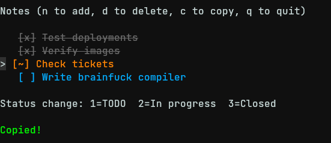

# Notes
Simple cli app for taking notes



# Build
1. Clone
```sh
git clone https://github.com/alexdenkk/notes
cd notes
```

2. Build
```sh
go mod download
go build -o cmd/note/main.go
```

3. Move to path
```sh
sudo mv note /usr/bin/
```

4. Run
```sh
note
```
